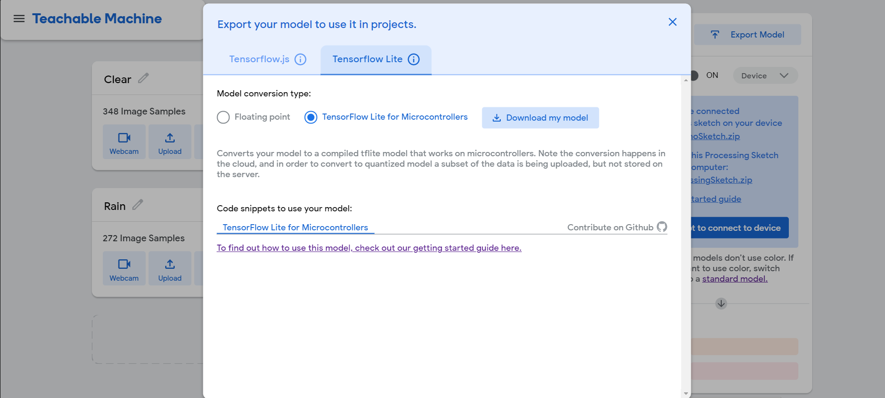
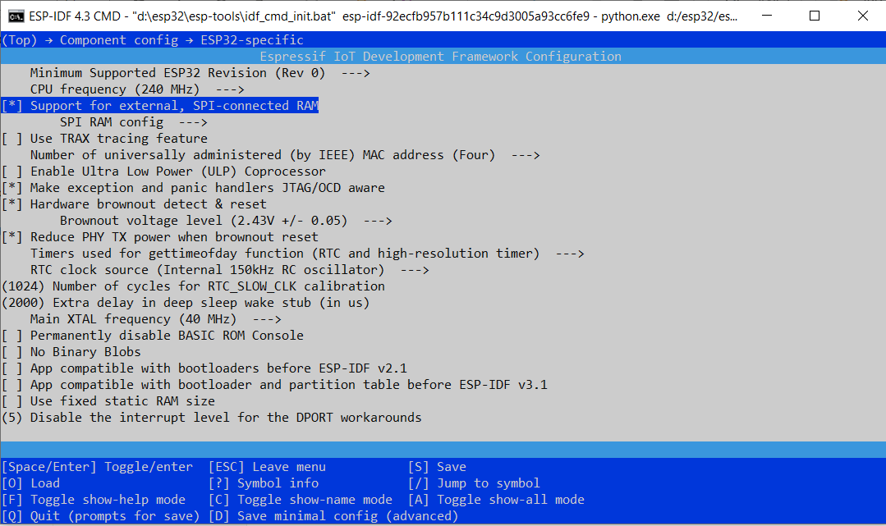
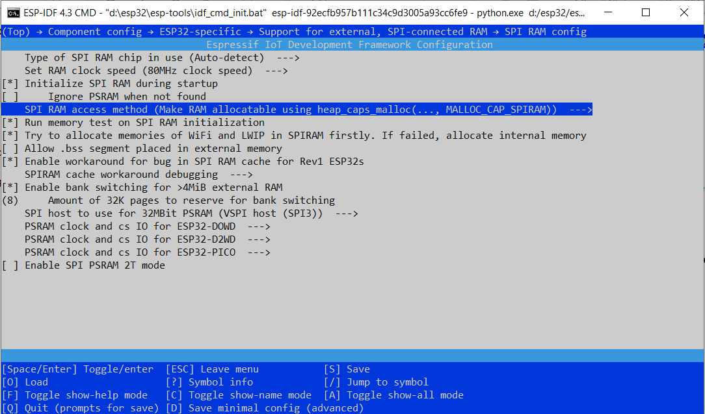

## ESP32 with Tensorflow Lite and Teachable Machine

This repository is to help you to use ESP32 as the deployment platform for Tensorflow Lite.

We will use the doorbell example together with an AI Thinker ESP32-CAM board as the target.

First you will need to follow the instructions on [Tensorflow Blog](https://blog.tensorflow.org/2020/08/announcing-tensorflow-lite-micro-esp32.html) in order to setup your environment as well as compile ad build the sample doorbell example. If for some reason you can't build check the **detection_responder.cc** file and make sure it is not empty. If its empty regenerate the files again using

```
make -f tensorflow/lite/micro/tools/make/Makefile TARGET=esp generate_doorbell_camera_esp_project  
```

For some reason it is a known [issue](https://github.com/tensorflow/tensorflow/issues/37431) that the detection_responder.cc file might be empty when you run it for the first time. 

Once that is done, we can use [Teachable machine](https://teachablemachine.withgoogle.com/) to train a custom model and modify the example code to use our custom model.

This set of codes has been tested to work with ESP-IDF v4.3.

### Training your model in Teachable Machine

After making sure you are able to download the ESP-IDF tools and successfully building Tensorflow Lite and the example door-bell application.

You need to train a new custom model. One of the easiest way is to use Teachable Machine to do that.

1. Select the **Image Project** -> **Embedded image model**
2. Upload your images and select **Train Embedded Model**
3. After training select **Export Model**
4. In Export model select **Tensorflow Lite** tab and **Tensorflow Lite for Microcontrollers** and there will be a zip file that will be downloaded



### Processing the zip file
Check out the changes at [https://github.com/sljm12/esp32_tensorflowlite/commit/fbbf48627e3b86008f30a9efb66a557e7b16a856](https://github.com/sljm12/esp32_tensorflowlite/commit/fbbf48627e3b86008f30a9efb66a557e7b16a856)

1. Unzip the zip file (converted_tinyml.zip)
2. Look for the following 3 files 
    - model_settings.h
    - model_settings.cpp
    - person_detect_model_data.cpp
3. Rename the cpp to cc
4. Copy the 3 files to **main** directory in the sample doorbell app replacing the same 3 files there.

### Modifying the micro_ops_resolver
Check out the changes at [https://github.com/sljm12/esp32_tensorflowlite/commit/4da8042e899d05e4f31248dbd12432f6bab7bf9f](https://github.com/sljm12/esp32_tensorflowlite/commit/4da8042e899d05e4f31248dbd12432f6bab7bf9f).

We will need to modify the **micro_op_resolver portion** in **main_functions.cc** to add in the kernals that are used in the Teachable Machine model. For more information you can read the docs [here](https://www.tensorflow.org/lite/guide/ops_version#change_kernel_registration). The kernals are bascially the various layers/operations that are used in your model, so if you are using a custom model you will need to find all the operations that your model use and put it here. The following is the one that is used in the Teachable Machine Image classification model.

Look for this section.

```
static tflite::MicroMutableOpResolver<3> micro_op_resolver; 

micro_op_resolver.AddBuiltin( tflite::BuiltinOperator_DEPTHWISE_CONV_2D, 
    tflite::ops::micro::Register_DEPTHWISE_CONV_2D()); 

micro_op_resolver.AddBuiltin(tflite::BuiltinOperator_CONV_2D, 
                             tflite::ops::micro::Register_CONV_2D()); 

micro_op_resolver.AddBuiltin(tflite::BuiltinOperator_AVERAGE_POOL_2D, 
                             tflite::ops::micro::Register_AVERAGE_POOL_2D()); 
```

and change to this.

```
static tflite::MicroMutableOpResolver<6> micro_op_resolver;  //You will need to change this from 3 to 6 because we are now loading 6 types of kernels.

micro_op_resolver.AddBuiltin( tflite::BuiltinOperator_DEPTHWISE_CONV_2D, 
    tflite::ops::micro::Register_DEPTHWISE_CONV_2D()); 

micro_op_resolver.AddBuiltin(tflite::BuiltinOperator_CONV_2D, 
                             tflite::ops::micro::Register_CONV_2D()); 

micro_op_resolver.AddBuiltin(tflite::BuiltinOperator_AVERAGE_POOL_2D, 
                             tflite::ops::micro::Register_AVERAGE_POOL_2D()); 

micro_op_resolver.AddBuiltin(tflite::BuiltinOperator_FULLY_CONNECTED, 
                             tflite::ops::micro::Register_FULLY_CONNECTED()); 

micro_op_resolver.AddBuiltin(tflite::BuiltinOperator_RESHAPE, 
                             tflite::ops::micro::Register_RESHAPE()); 

micro_op_resolver.AddBuiltin(tflite::BuiltinOperator_SOFTMAX, 
                             tflite::ops::micro::Register_SOFTMAX()); 
```

### Change Tensor Arena size
Check out the changes at [https://github.com/sljm12/esp32_tensorflowlite/commit/4da8042e899d05e4f31248dbd12432f6bab7bf9f](https://github.com/sljm12/esp32_tensorflowlite/commit/4da8042e899d05e4f31248dbd12432f6bab7bf9f).

If you do an idf.py build followed by a flash and monitor you might see this error message **"Arena size is too small for activation buffers. Needed 55296 but only 40864 was available.AllocateTensors() failed"** and ur esp goes into an inifite reboot.

You will need to allocate more memory to your tensor arena.

First do **idf.py menuconfig** to get into the **Espressif IoT Development Framework Configuration** tool.

Navigate to Component Config->ESP32 Specific page
1. Ensure that Support for external, SPI-connected RAM is checked or enabled.

2. Go to **SPI RAM config** on that same page and go to **SPI RAM Access method** and select **"Make RAM Allocatable using heaps_calls_malloc"**


Save and quit the tool

Next look at **main_functions.cc**

Look for 

```
constexpr int kTensorArenaSize = 93 * 1024;
static uint8_t tensor_arena[kTensorArenaSize];
```

and change to the following

```
constexpr int kTensorArenaSize = 1* 1024 * 1024; //Allocated 1 Meg
static uint8_t* tensor_arena = (uint8_t*) heap_caps_calloc(kTensorArenaSize, 1, MALLOC_CAP_SPIRAM);// Using PSRAM for the tensor_areana
```

add the following at the end of the header section

```
#include <esp_heap_caps.h>
```

### Other Changes

#### detection_responder.cc
You will probably need to modify this file to do whatever u want when the score passes the threshold and also the scores to pass in if you have more classes instead of just 2.
